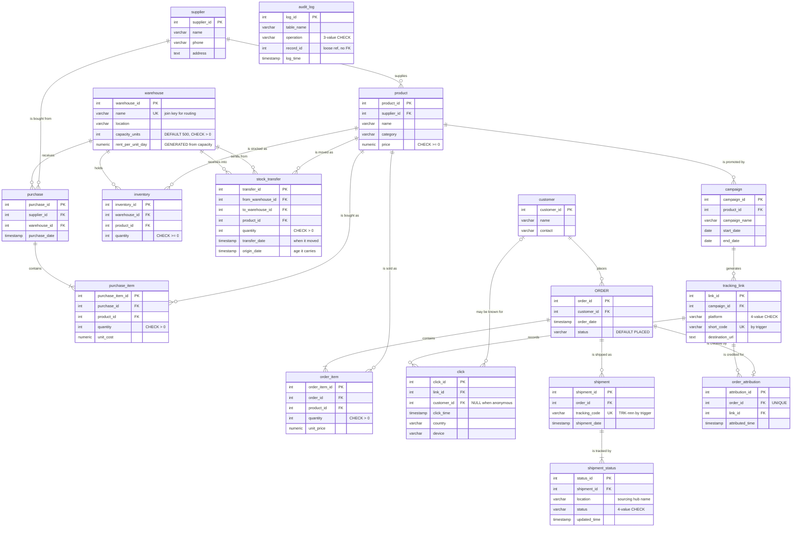

# TrackChain — Entity Relationship Diagram

The complete stored schema: **17 tables**, **21 foreign keys**, across six subsystems.
Views, functions and triggers are not shown here — only relations. Source of truth is
[`database/schema.sql`](../database/schema.sql).

> `ORDER` in the diagram below is the table `"order"` — a reserved word, quoted everywhere in the schema.

## Diagram

`audit_log` stands alone by design — it holds no foreign key.

## Foreign key reference

Anything not marked CASCADE uses the default `NO ACTION`: the parent cannot be deleted
while children exist.

| Child · column | Parent | Cardinality | On delete | Meaning |
|---|---|---|---|---|
| `product.supplier_id` | `supplier` | 1 : N | | A supplier sells many products; each product has one source |
| `inventory.warehouse_id` | `warehouse` | 1 : N | | Stock rows belong to a hub |
| `inventory.product_id` | `product` | 1 : N | | With the above, resolves warehouse ⇄ product M:N |
| `stock_transfer.from_warehouse_id` | `warehouse` | 1 : N | | Origin hub of a move |
| `stock_transfer.to_warehouse_id` | `warehouse` | 1 : N | | Destination hub; CHECK forbids equality |
| `stock_transfer.product_id` | `product` | 1 : N | | What was moved |
| `purchase.supplier_id` | `supplier` | 1 : N | | Who we bought from |
| `purchase.warehouse_id` | `warehouse` | 1 : N | | Where goods landed — the input for stock age |
| `purchase_item.purchase_id` | `purchase` | 1 : N | CASCADE | Line items are parts of a purchase |
| `purchase_item.product_id` | `product` | 1 : N | | What was bought |
| `"order".customer_id` | `customer` | 1 : N | | A customer places many orders |
| `order_item.order_id` | `"order"` | 1 : N | CASCADE | Line items die with their order |
| `order_item.product_id` | `product` | 1 : N | | What was sold |
| `shipment.order_id` | `"order"` | 1 : N | | One per order in practice — by trigger, not constraint |
| `shipment_status.shipment_id` | `shipment` | 1 : N | CASCADE | The status history of one shipment |
| `campaign.product_id` | `product` | 1 : N | | Each campaign promotes one product |
| `tracking_link.campaign_id` | `campaign` | 1 : N | | One link per platform per campaign |
| `click.link_id` | `tracking_link` | 1 : N | | Every click belongs to a link |
| `click.customer_id` | `customer` | 0..1 : N | | Nullable — social traffic is anonymous |
| `order_attribution.order_id` | `"order"` | 1 : 0..1 | CASCADE | UNIQUE — at most one attribution per order |
| `order_attribution.link_id` | `tracking_link` | 1 : N | | Which link earned the credit |

## Modeling decisions worth defending

**Attribution is its own table.** A `tracking_link_id` column on `"order"` would have been
simpler, but whether a campaign *caused* a purchase is a separate concern from the purchase
itself. Keeping it in `order_attribution` leaves the core order model clean and lets
attribution logic change without touching the order table.

**A generated column, not a stored rate.** `capacity_units → rent_per_unit_day` is a
functional dependency — bulk storage costs less per unit. Storing a hand-typed rate would
allow the classic update anomaly, where enlarging a hub silently leaves it on the old
small-hub price. `GENERATED ALWAYS … STORED` makes the dependency unbreakable at the
schema level.

**Stock age is stored nowhere.** `inventory` carries a quantity and no date, so age is
reconstructed FIFO from `purchase.purchase_date` and `stock_transfer.origin_date`. That is
why `origin_date` exists as a column distinct from `transfer_date` — moved units carry
their age with them, so nobody can clear a rent surcharge by bouncing a pallet between hubs.

**Status is a history, not a column.** `shipment_status` is a child table rather than a
`status` field on `shipment`, so every transition keeps its own timestamp and location.
That is what makes the pending-shipment cursor report and the public tracking page possible.
Its `location` field on the `Packed` row doubles as the sourcing-hub record.

**The audit log has no foreign key.** `record_id` points into `"order"`, `inventory`, or
`purchase` depending on `table_name`, so no single FK could express it — and a real FK
would defeat the purpose, since a log entry must outlive the row whose deletion it records.

**Two foreign keys to one parent.** `stock_transfer` references `warehouse` twice, as
origin and destination. The `CHECK (from ≠ to)` is what keeps the relationship meaningful:
without it a "move" could be a no-op that still credited itself a fresh arrival date.
